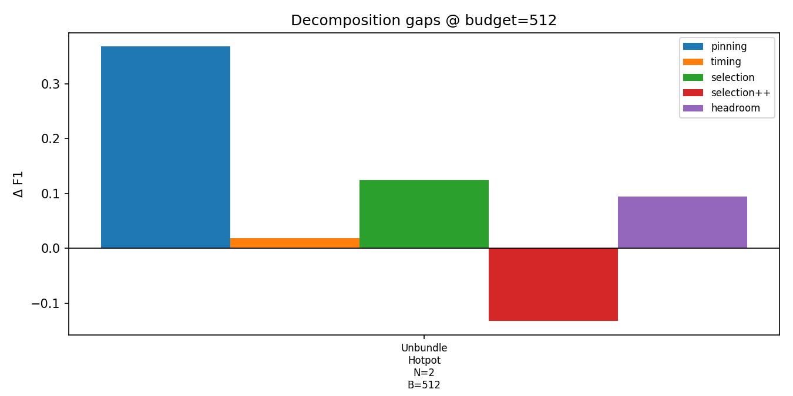

# Heuristic Ladder

A controlled harness for decomposing *where* the gains of learned context compression come from. It runs a six-rung **heuristic ladder** (H0, H0p, H1–H3, Oracle) on a single frozen backbone with a fixed retrieval and action space, so the only variable across rungs is the compression policy. The central question: how much of the benefit that RL-trained folding methods (MEM1, BACM-RL/FoldAct, PEEK) attribute to *learning* is already recoverable by training-free heuristics, once pinning, timing, and selection are isolated?

## Findings



The old H0→H1 gap bundled two changes (reactive→proactive *and* allowing the question to be dropped→pinning it). An intermediate rung **H0p** (reactive truncation, question pinned) unbundles them. Spot-check on HotpotQA, N=2, budget 512, **n=51** matched examples (`results/unbundle_hotpot_n2_b512.jsonl`; headline metric `mem1_table_summed_f1`):

| gap | Δ F1 | note |
|---|---|---|
| **Pinning (H0→H0p)** | **+0.37** | Dominates. H0 keeps the question on only ~25% of examples; H0p/H1 keep it on 100%. |
| Timing (H0p→H1) | +0.02 | Near null once the question is pinned (8/8/35 up/down/tie). |
| Selection (H1→H2) | +0.12 | Positive here; prior full-grid BM25 re-runs put this within run-to-run noise — treat as unconfirmed at n=51 / one cell. |
| Selection++ (H2→H3) | −0.13 | Negative on this cell; not established. |
| Headroom (H3→Oracle) | +0.09 | Oracle is a **selection** ceiling given gold labels, not a timing ceiling. |

**Takeaway.** The large effect previously attributed to “timing” was mostly **question retention**. Pure timing (proactive vs reactive, both pinning) is small on this binding cell. Selection / summarize-instead-of-delete are not established from a single seed; absolute F1 next to published tables is confounded (pool retrieval + hosted DeepInfra backbone). The object of this study is the rung-to-rung gaps.

The earlier BM25 grid without H0p (`results/rerun/`) still measures hosted-backbone run-to-run noise; e5 (`results/*_e5.jsonl`) does not change the pinning story.

## The ladder

Each rung adds exactly one design decision, so every adjacent gap measures one thing:

| transition | what it isolates |
|---|---|
| H0 → H0p | **Pinning** — does keeping the question under reactive truncation recover the collapse? |
| H0p → H1 | **Timing** — does acting before overflow help, holding the pin fixed? |
| H1 → H2 | **Selection** — does *what* you drop matter, holding timing fixed? |
| H2 → H3 | **Selection++** — do anchoring plus summarize-instead-of-delete add more? |
| H3 → Oracle | **Ceiling** — how much headroom is left to perfect *selection* (gold-aware drop order)? |

Learned methods are not a rung. They never decomposed pinning, timing, and selection, so where they land relative to H3 and Oracle is the *finding*, not an input. This harness does not execute their code; comparing against their published numbers is a separate, confounded step and is left to future work. The internal gaps share one retriever, one backbone, and one prompt within a run.

## Fairness invariants

These are enforced in code, not merely intended:

- **One backbone, temperature 0.** Every rung in a given run calls the same `Qwen/Qwen2.5-7B-Instruct` with identical decoding settings. (`ladder/llm.py`)
- **Identical everything-except-the-policy.** Same retriever (BM25 over the example's own paragraph pool by default), same action space (a think / search / answer ReAct loop with results returned inside an information block, per Search-R1), same prompt. (`ladder/agent.py`)
- **Only the Oracle may read gold labels.** `Block.is_supporting` is read exclusively by `Oracle`; every other rung is blind to it. The Oracle is built directly from the datasets' supporting-fact annotations, never hand-judged. (`ladder/policies.py`)
- **Token-accurate budgets.** Budgets are measured in real Qwen tokens with the backbone's own tokenizer; the same counter is used for all rungs. (`ladder/tokenizer.py`)
- **Two scoring protocols, reported and never conflated.** `mem1_table` is the headline protocol — it matches MEM1's `eval.py` exactly (MEM1 preprocessing, set-based token F1, strict semicolon splitting, and zero for the whole example when the answer count is wrong). `standard_qa` is the SQuAD/HotpotQA-style diagnostic (Counter-based token F1 with forgiving pad/truncate behavior). (`ladder/report.py`)
- **No per-dataset tuning.** The only dev-set knob is H3's summary length. The evaluation grid should be fixed before inspecting test-split results.

**H0** may drop any block under reactive truncation, including the question (logged as `question_kept`). From **H0p** upward, the question is pinned and only the evidence store (observation / summary blocks) is compressible; the reasoning trace is transient and regenerated each turn. Budget pressure is therefore from accumulated evidence — what the compression literature targets — once the pin is on. (`ladder/policies.py`)

## Installation

```bash
pip install -r requirements.txt
```

An OpenAI-compatible endpoint serving the backbone is also required. The default is DeepInfra; copy `.env.example` to `.env` and set:

```
DEEPINFRA_API_KEY="your_key_here"
```

To serve the backbone locally instead, run it with vLLM (`vllm serve Qwen/Qwen2.5-7B-Instruct`) and pass `--base-url http://localhost:8000/v1`. The code path is identical.

### Backbone fidelity

**What we did.** Reported results were produced against DeepInfra's hosted copy of `Qwen/Qwen2.5-7B-Instruct` at temperature 0. Because the weights are served by a third party, their precision is not visible to us and the deployment may change over time, so a run is not bit-reproducible and cannot be certified as the exact reference weights prior work used. The replication above measures that variability directly.

This does not invalidate within-run rung-to-rung gaps: every rung in a given run hits the same endpoint with the same decoding settings. Absolute scores next to published tables inherit both this host-model variability and the differing retrieval setup.

**Future work.** Re-run the final grid against a locally served, full-precision Qwen on a single CUDA GPU via vLLM. That fixes the weights, precision, and decoding under our own control. It requires no code change — only a different `--base-url`.

## Data

HotpotQA and 2WikiMultihopQA are the datasets used in all reported runs. MuSiQue is supported by the loader (same supporting-passage interface) but has not been run yet. Caches are normalized JSONL under `data/`:

| name | HuggingFace id | labels used | in reported grids |
|---|---|---|---|
| `hotpotqa` | `hotpotqa/hotpot_qa` (config `distractor`) | `supporting_facts` | yes |
| `2wiki` | `scholarly-shadows-syndicate/2wikimultihopqa` | `supporting_facts` | yes |
| `musique` | `dgslibisey/MuSiQue` | `paragraphs.is_supporting` | not yet |

```bash
python -m ladder prepare-data --datasets hotpotqa,2wiki --splits test
```

Official test splits have no public labels, so **`test` maps to the validation split** and **`dev` maps to the train split** (used only for tuning; pass `--limit` to take a slice of it). This is handled by `SPLIT_ALIASES` in `ladder/data.py`. After the JSONL exists, data loads are fully offline; only LLM API calls need the network.

## Running experiments

```bash
# a quick pilot: 20 HotpotQA examples, all rungs, two binding budgets
python -m ladder run \
  --datasets hotpotqa --splits test --n-objectives 1 \
  --budgets 512,256 --policies H0,H0p,H1,H2,H3,Oracle \
  --limit 20 --out results/pilot.jsonl

# unbundle spot-check (pinning vs timing; see Findings)
python -m ladder run \
  --datasets hotpotqa --splits test --n-objectives 2 \
  --budgets 512 --policies H0,H0p,H1,H2,H3,Oracle \
  --limit 55 --seed 0 --out results/unbundle_hotpot_n2_b512.jsonl
```

Reported multi-objective budgets are **512 / 1024 / 2048** (binding on these pools). Larger budgets (e.g. 4k–16k) are where compression stops firing on single-hop-scale pools.

## Aggregation

```bash
# canonical BM25 re-run (all shards)
python -m ladder aggregate --results \
  results/rerun/rerun_hotpot_n1.jsonl,results/rerun/rerun_hotpot_n2.jsonl,results/rerun/rerun_hotpot_n8.jsonl,results/rerun/rerun_2wiki_n2.jsonl,results/rerun/rerun_2wiki_n8.jsonl

# single file / single metric
python -m ladder aggregate --results results/rerun/rerun_hotpot_n2.jsonl --metric mem1_table_summed_f1
```

For each `(dataset, split, n_objectives, budget)` group, the report prints every rung's score, its **% of the Oracle ceiling**, peak context tokens, mean inference tokens, compression counts, the **fraction of supporting evidence kept** (`suppKept`), **question retention** (`qKept`), and the five decomposition gaps (pinning / timing / selection / selection++ / headroom).

`aggregate` warns if rungs in a group were not run on the same example ids (a mismatch that existed in an older exploratory file; the `results/rerun/` shards are matched).

The `both` headline uses **`mem1_table_summed_f1`** — F1 summed over objectives then meaned over examples — because that is what MEM1's own `eval.py` reports. Never compare a `standard_qa_*` number directly against a published MEM1 table.

## Retrieval backend

`--retrieval` selects the ranking backend, shared by the retriever and the H2/H3 selection scorer:

- `bm25` (default) — sparse, dependency-free.
- `e5` — uses `intfloat/e5-base-v2`, the dense retriever Search-R1 uses by default; requires `pip install sentence-transformers`.

Keep the backend identical across any runs you compare.

## Budget guidance

- **Single-objective** HotpotQA/2Wiki have ~10 short paragraphs (~1–2k tokens); use small budgets (**256–1024**) or the rungs coincide because no compression fires — itself a valid finding.
- **Multi-objective** unions many pools; **512–2048** binds on the grids we report.

## Cost normalization

Every run records measured inference tokens (`prompt_tokens + completion_tokens`) and LLM call counts. Heuristics carry zero training cost. H3's summarizer calls appear honestly in the inference token totals.

## Comparison to learned methods

1. **Within-run gaps are comparable across rungs** — same retriever, backbone endpoint, and prompt.
2. **Any number placed next to a published table is confounded** — those papers used whole-Wikipedia dense retrieval and often a different / RL-trained backbone; ours use a gold-plus-distractor pool on a hosted Qwen2.5-7B-Instruct.

Re-running a learned checkpoint *inside this harness* is future work and is not wired in. Treat the unbundled rung decomposition (especially pinning vs timing) as the contribution.

## Repository layout

```
ladder/
  __init__.py             package init; disables tokenizers parallelism
  blocks.py               Block + Context: the interaction history and token-budgeted window
  tokenizer.py            token counting with the frozen Qwen2.5 tokenizer (BACKBONE_MODEL)
  data.py                 dataset loaders (HotpotQA, 2Wiki, MuSiQue) + multi-objective construction
  retrieval_scoring.py    BM25 + E5 retrievers and selection scorers
  policies.py             H0, H0p, H1–H3 + Oracle policies and the H3 query-focused summarizer
  llm.py                  frozen-backbone LLM client and the ReAct prompt template
  agent.py                the fixed ReAct environment shared by all rungs
  report.py               mem1_table + standard_qa scoring, aggregation, decomposition report
  __main__.py             CLI (prepare-data / run / aggregate) and the experiment grid runner
tests/
  test_policies.py        offline behavioural tests for the compression rungs
  test_metrics.py         offline tests for the scoring protocols
scripts/
  plot_ladder_results.py  plots from the unbundle spot-check (+ e5 comparison from exploratory files)
  compare_e5_bm25.py      e5 vs bm25 on matched example ids
data/                     normalized dataset caches (HotpotQA, 2Wiki)
results/
  unbundle_hotpot_n2_b512.jsonl   pinning-vs-timing spot-check (n=51; basis for Findings)
  rerun/                  earlier BM25 grid without H0p (noise floor / e5 companion)
  pool_*.jsonl            exploratory BM25 / e5 runs
  figures/                plots from scripts/plot_ladder_results.py
.env.example
requirements.txt
pyproject.toml            ruff configuration
LICENSE
```

Regenerate figures:

```bash
python scripts/plot_ladder_results.py
python scripts/compare_e5_bm25.py
```

## Tests

```bash
python tests/test_policies.py
python tests/test_metrics.py
```

Both are offline (no network, no API). They assert the behavioural difference between rungs — e.g. that H0 can discard the question, H0p pins it under reactive truncation, H1 is proactive with the pin, H2 drops least-relevant (not oldest), H3 summarizes and anchors recency, the Oracle sheds distractors before gold evidence, and summarized supporting blocks count toward `final_supporting_kept`.
