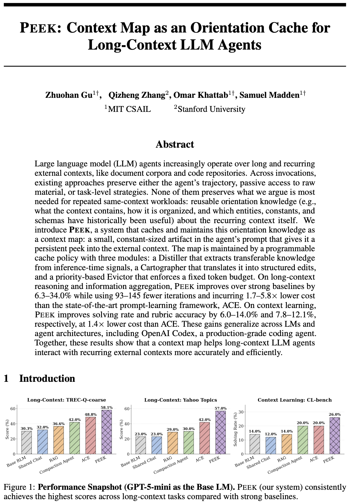

# PEEK: Context Map as an Orientation Cache for Long-Context LLM Agents

<div align="center">

<p align="center">
  <a href="https://arxiv.org/abs/2605.19932" target="_blank">
    
  </a>
  <a href="https://zhuohangu.github.io/blog-post-peek/" target="_blank">
    
  </a>
  <a href="https://forms.gle/73cGdSqQN3mfFRdu8" target="_blank">
    
  </a>
</p>


<p align="center">
  <a href="https://arxiv.org/abs/2605.19932">
    
  </a>
</p>

</div>

---

## Overview

PEEK caches reusable *orientation knowledge* about long and recurring external contexts (e.g., document corpora and code repositories) that LLM agents operate on, representing this knowledge as a *context map*. Inspired by computer-system caches and database indexes, PEEK treats the context map as a small, prompt-resident cache of a much larger external context. This helps the agent understand, navigate, and act on that context more efficiently and reliably.

PEEK manages the map through a modular cache policy. It is **agent- and model-agnostic, as well as unsupervised**: it makes no assumptions about the agent’s architecture or scaffolding, and works with both open- and closed-source LMs, including most frontier models. PEEK uses inference-time signals (without requiring ground-truth labels) and returns an updated map that can be prepended to the next call.

> [!NOTE]
> This repository is for the PEEK system itself.

## 🚀 Quick Setup

```bash
pip install peek-ai            # core (tiktoken only)
pip install peek-ai[openai]    # + OpenAI / OpenAI-compatible endpoints
pip install peek-ai[anthropic] # + Anthropic
pip install peek-ai[gemini]    # + Google Gemini
pip install peek-ai[all]       # all of the above
```

A minimal loop around your own agent looks like this:

```python
from peek import CachePolicy
from peek.llm.openai_client import OpenAIClient

client = OpenAIClient(model="gpt-5-mini-2025-08-07")
policy = CachePolicy(client=client, token_budget=1024, evolve_steps=10)

for question in stream_of_questions:
    system_prompt = f"{base_instructions}\n\nContext Map:\n{policy.current_map_text}"
    trajectory = my_agent.run(system_prompt, question, long_external_context)
    policy.update(trajectory=trajectory, question=question)

policy.save("maps/my-corpus.peek.json")
```

### Model Providers

Any object satisfying [`peek.LMClient`](src/peek/llm/base.py) works as the Distiller/Cartographer backbone — implement `completion(messages)` and `last_usage()` and you can plug in vLLM, Together, Ollama, or a local stub. Three reference clients ship with the package:

| Provider  | Class                                | Extra                |
|-----------|--------------------------------------|----------------------|
| OpenAI    | `peek.llm.OpenAIClient`              | `peek-ai[openai]`    |
| Anthropic | `peek.llm.AnthropicClient`           | `peek-ai[anthropic]` |
| Gemini    | `peek.llm.GeminiClient`              | `peek-ai[gemini]`    |


## 📖 Relevant Reading

- **PEEK paper** — [arXiv:2605.19932](https://arxiv.org/abs/2605.19932)
- **Blog post** — [Give Your Agent an Orientation Cache](https://zhuohangu.github.io/blog-post-peek/)

## 🤝 Contributing

We welcome contributions! A simple path to contribute:

1. Fork the repository
2. Create a feature branch (`git checkout -b feature/amazing-feature`)
3. Commit your changes (`git commit -m "Add amazing feature"`)
4. Push to the branch (`git push origin feature/amazing-feature`)
5. Open a Pull Request

> [!NOTE]
> For larger changes, we’re happy to start with a discussion to align on scope before implementation.

### 📧 Contact
- **Paper Authors**: See the [arXiv paper](https://arxiv.org/abs/2605.19932) for author contact information.
- **Interest and Feedback**: Please fill out the [form](https://forms.gle/73cGdSqQN3mfFRdu8).
- **Issues**: Please open an issue on GitHub.


---


## 📝 Citation

If you use PEEK in your research, please cite:

```bibtex
@misc{gu2026peekcontextmaporientation,
      title={PEEK: Context Map as an Orientation Cache for Long-Context LLM Agents}, 
      author={Zhuohan Gu and Qizheng Zhang and Omar Khattab and Samuel Madden},
      year={2026},
      eprint={2605.19932},
      archivePrefix={arXiv},
      primaryClass={cs.AI},
      url={https://arxiv.org/abs/2605.19932}, 
}
```

<div align="center">

**⭐ Star us on GitHub if PEEK helps your research!**

</div>
